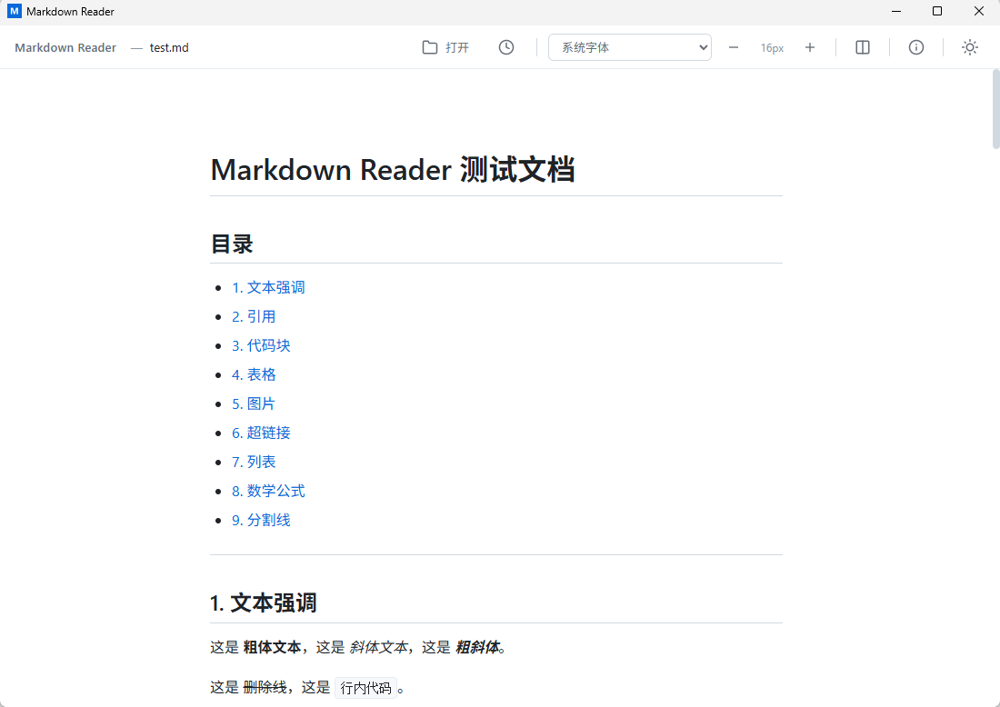
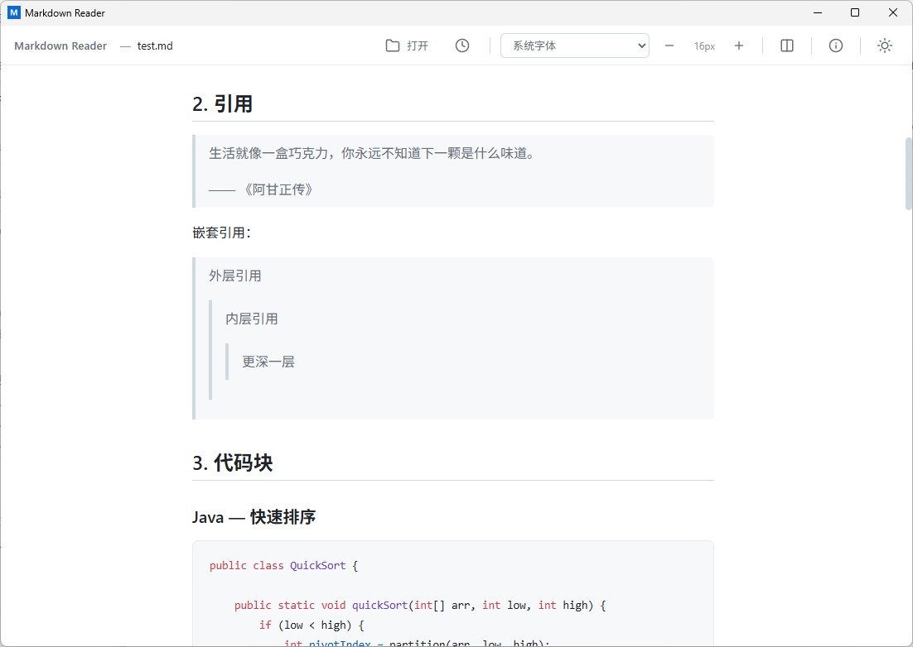
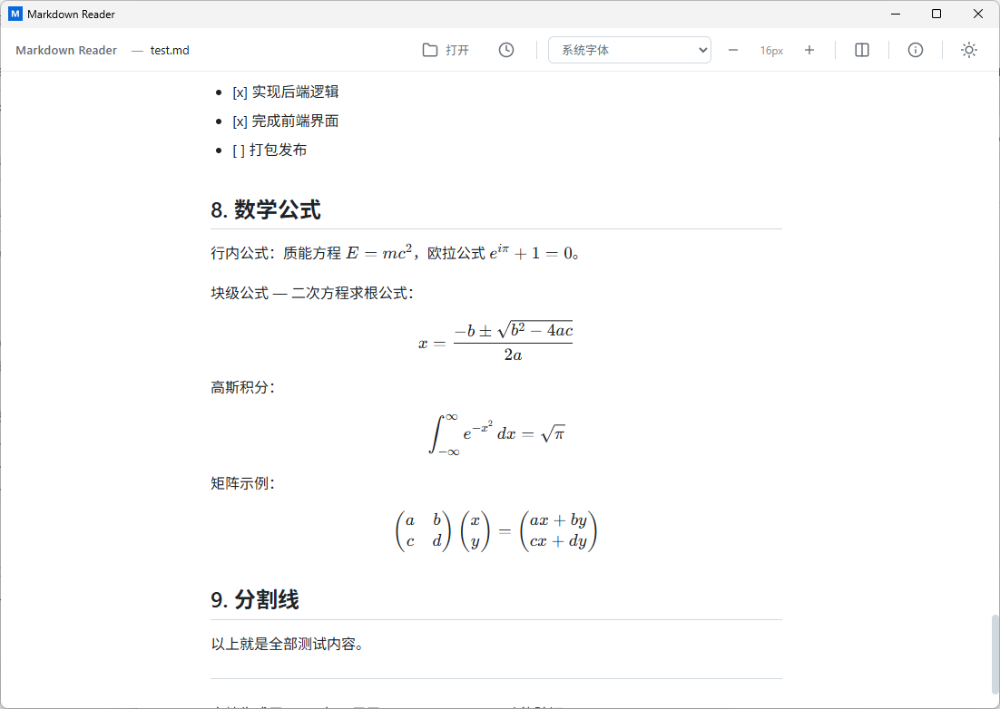

# Markdown Reader

[English](./README.md)

一个基于 Rust + Tauri 2 构建的轻量级 Markdown 桌面阅读器，专为分享 `.md` 文件而设计 — 拖拽即可阅读。

> **这是一个 100% Vibe Coding 的项目。** 整个代码库——前端、后端、文档和构建配置——全部通过 AI 辅助编程（Claude Code）生成，没有任何一行人工手写代码。

## 功能特性

- 拖拽 `.md` 文件到窗口直接打开
- 通过文件对话框或 `Ctrl+O` 打开文件
- 完整 Markdown 渲染：标题、列表、表格、引用、图片、链接
- 代码语法高亮（highlight.js）
- LaTeX 数学公式支持（KaTeX）
- 亮色 / 暗色主题切换
- 字号调整
- 系统字体切换
- 最近文件历史
- 检查 GitHub Releases 新版本更新
- 在 About 中打开配置文件夹
- 便携免安装，配置存储在用户目录

## 截图





## 安装

### 下载

前往 [Releases](https://github.com/CmcnPro/MarkdownReader/releases) 页面下载最新的 `.exe` 或便携版。

### 从源码构建

**环境要求：**

- [Rust](https://www.rust-lang.org/tools/install) 1.70+
- [Node.js](https://nodejs.org/) 18+

```bash
# 克隆仓库
git clone https://github.com/CmcnPro/MarkdownReader.git
cd MarkdownReader

# 安装前端依赖
npm install

# 开发模式运行
npm run tauri dev

# 构建生产版本
npm run tauri build
```

## 技术栈

| 层级 | 技术 |
|------|------|
| 框架 | Tauri 2 |
| 后端 | Rust |
| 前端 | Vite + TypeScript |
| Markdown 渲染 | markdown-it |
| 代码高亮 | highlight.js |
| 数学公式 | KaTeX + markdown-it-texmath |
| 存储 | 用户目录 JSON 配置 |

## 项目结构

```
MarkdownReader/
├── src/                    # 前端源码
│   ├── index.html          # 主页面
│   ├── main.ts             # 应用逻辑
│   └── styles.css          # 样式
├── src-tauri/              # Rust 后端
│   └── src/
│       ├── main.rs         # 入口
│       └── lib.rs          # 业务逻辑
├── vite.config.ts          # Vite 配置
└── package.json            # 依赖
```

## 文档

- [AGENTS.md](./AGENTS.md) — AI Agent 开发指南

## 许可证

[MIT](./LICENSE)
